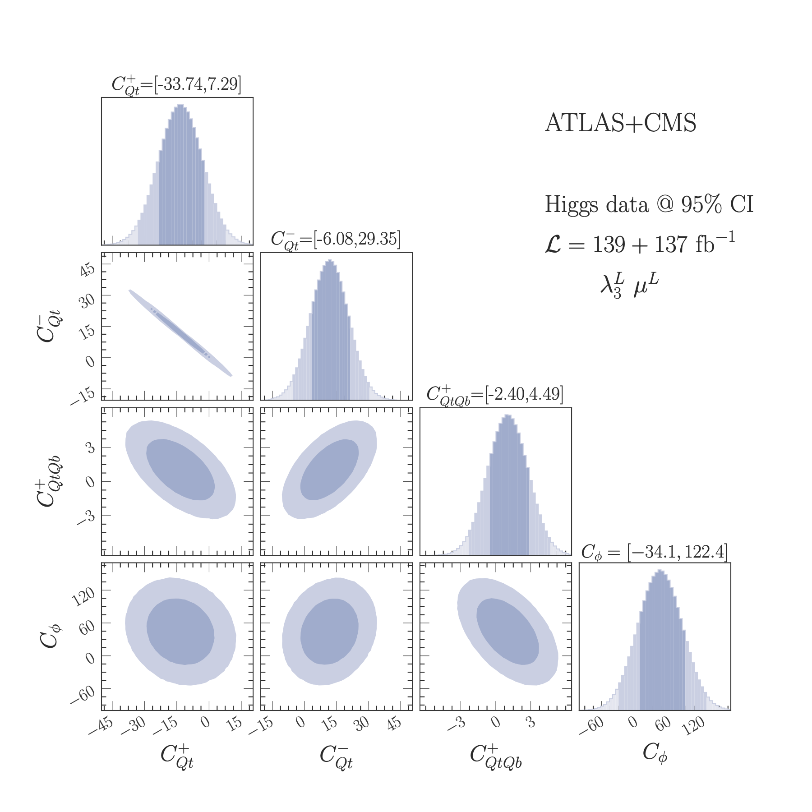

# Four-fermion operators in Higgs production and decay

A repository for t (SMEF)he code, data, and results for the fits of 4 heavy quark operators with the Higgs trilinear self-interaction in Standard Model Effective field theory (SMEFT). 



Lina Alasfar, Jorge de Blas, and Ramona Gröber  


If you use this code or the results of the work please cite:  

```
citation
```
- The main file to run the MCMC Bayesian fits is RunAllFits.py, which calls scripts from the Scripts directory. 
-  Jupyter notebooks for the MCMC Bayesian fits visualisation and doing fits with new variables are found in the Notebooks directory
- All the plotting code used for this analysis is found in the Notebooks. Some plots are not found in the draft.
- Person $\chi^2$ fit is used as a cross-check and to easily study correlations. The Secondary fits and study correlations Jupyter notebooks.
- The Helperfunctions directory contains the main Liklehood functions, for 2 parameeter fits, and for all parameters at the same time. In addition to the MCMC fit functions. 
- The results directory contains all the plots used in the draft, and more. Noreover,the posteroir distributions pickled. data.yaml contains the NLO corrections for each Wilson coeffecints as well as the experimental input used for the fit. 
- To run the Perl script that generates the tables you need CPAN shell 

```
perl -MCPAN -e shell
install LaTeX::Table
install YAML
```
